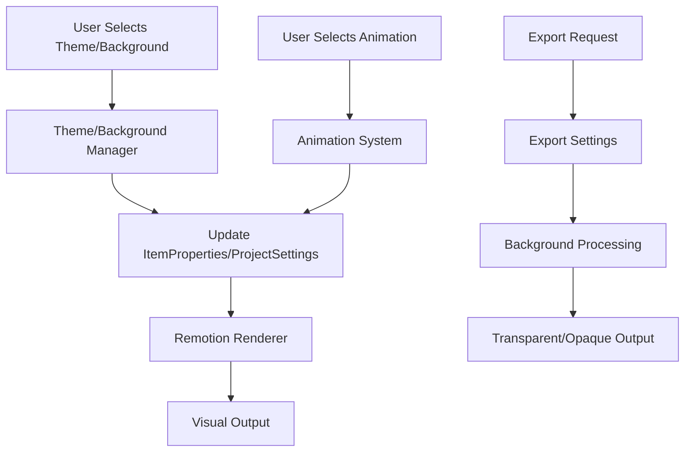

# Design Document

## Overview

This design document outlines the implementation of advanced editor features that will significantly enhance the visual capabilities of the code editor. The features include enhanced code diff animations, comprehensive theming system, background customization (wallpapers and gradients), and transparent background export functionality.

The design builds upon the existing architecture, extending the current `ItemProperties`, `ExportSettings`, and animation systems while maintaining backward compatibility.

## Architecture

### Core Components

1. **Enhanced Animation System**: Extends the existing `AnimationConfig` union type to support new diff animation modes
2. **Theme Management System**: Centralizes theme definitions and provides runtime theme switching
3. **Background System**: Manages wallpapers, gradients, and transparency settings
4. **Export Enhancement**: Extends export pipeline to support transparent backgrounds
5. **UI Controls**: Enhanced Inspector and export dialog components

### Data Flow



## Components and Interfaces

### 1. Enhanced Type Definitions

```typescript
// Extended ItemProperties for new features
interface ItemProperties {
  // ... existing properties

  // Enhanced code diff animations
  diffAnimationType?:
    | 'slide'
    | 'fade'
    | 'highlight'
    | 'typewriter-diff'
    | 'line-focus-diff';
  diffAnimationSpeed?: number;
  diffHighlightColor?: string;

  // Background system
  backgroundType?: 'none' | 'color' | 'gradient' | 'wallpaper';
  backgroundWallpaper?: string; // URL or asset ID
  backgroundGradient?: GradientConfig;
  backgroundOpacity?: number;
}

// New gradient configuration
interface GradientConfig {
  type: 'linear' | 'radial';
  colors: Array<{ color: string; position: number }>;
  angle?: number; // for linear gradients
  centerX?: number; // for radial gradients
  centerY?: number; // for radial gradients
}

// Enhanced project settings
interface ProjectSettings {
  // ... existing properties
  globalBackground?: BackgroundConfig;
  defaultTheme?: string;
}

interface BackgroundConfig {
  type: 'none' | 'color' | 'gradient' | 'wallpaper';
  color?: string;
  gradient?: GradientConfig;
  wallpaper?: {
    assetId: string;
    opacity: number;
    blendMode: 'normal' | 'multiply' | 'overlay' | 'soft-light';
  };
}

// Enhanced export settings
interface ExportSettings {
  // ... existing properties
  transparentBackground?: boolean;
  includeWallpaper?: boolean;
  includeGradient?: boolean;
}
```

### 2. Theme Management System

```typescript
interface ThemeDefinition {
  id: string;
  name: string;
  category: 'light' | 'dark' | 'high-contrast';
  colors: {
    background: string;
    foreground: string;
    comment: string;
    keyword: string;
    string: string;
    number: string;
    operator: string;
    function: string;
    variable: string;
    // ... additional syntax colors
  };
  fonts?: {
    primary?: string;
    monospace?: string;
  };
}

interface ThemeManager {
  getTheme(id: string): ThemeDefinition | null;
  getAllThemes(): ThemeDefinition[];
  getThemesByCategory(category: string): ThemeDefinition[];
  registerTheme(theme: ThemeDefinition): void;
  applyTheme(itemId: string, themeId: string): void;
}
```

### 3. Background Management System

```typescript
interface BackgroundManager {
  setWallpaper(assetId: string, opacity?: number): void;
  setGradient(config: GradientConfig): void;
  setColor(color: string): void;
  clearBackground(): void;
  getBackgroundPreview(): string; // Base64 preview
}

interface WallpaperAsset {
  id: string;
  name: string;
  url: string;
  thumbnail: string;
  dimensions: { width: number; height: number };
  category: 'abstract' | 'nature' | 'tech' | 'minimal' | 'custom';
}
```

### 4. Enhanced Animation System

Extends the existing `AnimationConfig` union:

```typescript
type AnimationConfig =
  // ... existing animations
  | {
      preset: 'diffSlide';
      direction: 'left' | 'right' | 'up' | 'down';
      speed: number;
      highlightColor: string;
    }
  | {
      preset: 'diffFade';
      fadeInDuration: number;
      fadeOutDuration: number;
      highlightIntensity: number;
    }
  | {
      preset: 'diffHighlight';
      highlightColor: string;
      pulseEffect: boolean;
      duration: number;
    }
  | {
      preset: 'typewriterDiff';
      speedCps: number;
      showCursor: boolean;
      highlightChanges: boolean;
    };
```

## Data Models

### Theme Storage

- Themes stored as JSON configurations in `src/themes/` directory
- Runtime theme registry for dynamic loading
- User custom themes stored in project settings

### Background Assets

- Wallpapers stored as media assets with special category
- Built-in wallpaper collection included in app bundle
- Gradient configurations stored in project/item properties

### Animation Presets

- Extended animation preset system for diff animations
- Configurable timing and visual parameters
- Preview system for real-time animation testing

## Error Handling

### Theme Loading

- Fallback to default theme if custom theme fails to load
- Validation of theme color values and structure
- Graceful degradation for missing theme properties

### Background Processing

- Image loading error handling with fallback to solid color
- Gradient validation and sanitization
- Memory management for large wallpaper assets

### Export Pipeline

- Transparent background format validation
- Fallback export options if transparency not supported
- Progress reporting for complex background processing

### Animation System

- Animation parameter validation
- Performance monitoring for complex diff animations
- Graceful fallback to simpler animations on performance issues

## Testing Strategy

### Unit Tests

- Theme manager functionality
- Background configuration validation
- Animation parameter processing
- Export settings validation

### Integration Tests

- Theme application to code sequences
- Background rendering in Remotion
- Export pipeline with transparency
- Animation preview generation

### Visual Regression Tests

- Theme rendering consistency
- Background composition accuracy
- Animation timing verification
- Export output quality validation

### Performance Tests

- Large wallpaper asset handling
- Complex gradient rendering performance
- Multiple animation layers performance
- Export speed with transparency

### User Acceptance Tests

- Theme switching workflow
- Background customization experience
- Animation selection and preview
- Export dialog usability with new options

## Implementation Phases

### Phase 1: Enhanced Diff Animations

- Extend AnimationConfig with new diff animation types
- Implement slide, fade, and highlight diff animations
- Update CodeSequence component to handle new animations
- Add animation controls to Inspector

### Phase 2: Theme System

- Create ThemeManager and theme definitions
- Extend existing theme system with more comprehensive themes
- Add theme selection UI to Inspector
- Implement theme preview functionality

### Phase 3: Background System

- Implement BackgroundManager and wallpaper support
- Add gradient configuration system
- Create background selection UI
- Integrate backgrounds with Remotion rendering

### Phase 4: Transparent Export

- Extend ExportSettings with transparency options
- Modify export pipeline to support alpha channels
- Update ExportDialog with transparency controls
- Add format validation for transparency support

### Phase 5: UI Polish and Integration

- Enhance Inspector with all new controls
- Add real-time preview capabilities
- Implement settings persistence
- Performance optimization and testing
