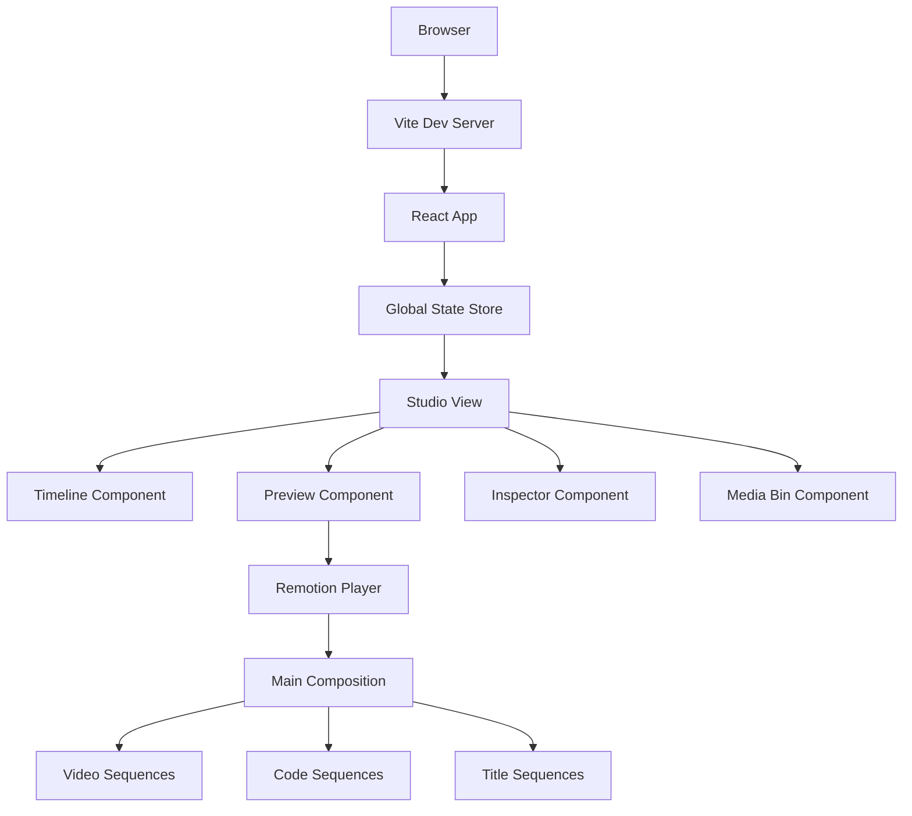

# Design Document

## Overview

Synapse Studio is architected as a modern Single Page Application (SPA) built with React 18+, TypeScript, and Vite. The application leverages Remotion as its core video rendering engine, enabling programmatic video generation through React components. The design follows a component-based architecture with unidirectional data flow, centered around a global state management system that serves as the single source of truth for video projects.

The application consists of three main views: Dashboard (project management), Studio (main editor), and Media Hub (asset management). The Studio view contains four primary components: Timeline, Preview, Inspector, and Media Bin, all orchestrated through a centralized state management system.

## Architecture

### High-Level Architecture



### State Management Architecture

The application uses a hybrid approach starting with React Context API for simplicity, with the ability to migrate to Zustand if complexity increases:

- **Project State**: Timeline data, media assets, selected items
- **UI State**: View modes, panel visibility, playback controls
- **Export State**: Render progress, export settings, output management

### Data Flow

1. **User Interaction** → UI Components
2. **UI Components** → State Actions (via Context/Zustand)
3. **State Updates** → Component Re-renders
4. **State Changes** → Remotion Player (via inputProps)
5. **Remotion Player** → Video Rendering

## Components and Interfaces

### Core Components

#### StudioView.jsx
- **Purpose**: Main controller for the video editor interface
- **Responsibilities**: 
  - Orchestrates child components
  - Manages layout and responsive behavior
  - Handles keyboard shortcuts and global interactions
- **Props**: Project data from global state
- **State**: Local UI state (panel sizes, view modes)

#### Timeline.jsx
- **Purpose**: Visual timeline interface for clip arrangement
- **Responsibilities**:
  - Renders timeline tracks and clips
  - Handles drag-and-drop operations
  - Manages clip selection and manipulation
  - Provides zoom and scroll functionality
- **Key Features**:
  - Multi-track support
  - Snap-to-grid functionality
  - Real-time duration calculations
  - Visual feedback for overlapping clips

#### Preview.jsx
- **Purpose**: Video preview and playback control
- **Responsibilities**:
  - Hosts Remotion Player component
  - Manages playback state and controls
  - Handles seeking and frame-accurate positioning
- **Integration**: Direct connection to Remotion engine via inputProps

#### Inspector.jsx
- **Purpose**: Property panel for selected timeline items
- **Responsibilities**:
  - Displays item properties and metadata
  - Provides animation preset selection
  - Offers parameter adjustment controls
  - Validates user input

#### MediaBin.jsx
- **Purpose**: Asset management and organization
- **Responsibilities**:
  - Displays imported media assets
  - Handles file uploads and validation
  - Provides drag-and-drop to timeline
  - Shows asset previews and metadata

### Remotion Components

#### MainComposition.jsx
- **Purpose**: Primary Remotion composition that renders the final video
- **Responsibilities**:
  - Receives timeline and asset data via inputProps
  - Maps timeline items to appropriate sequences
  - Manages composition timing and layering
- **Dynamic Rendering**: Conditionally renders different sequence types based on asset types

#### VideoSequence.jsx
- **Purpose**: Renders video clips within the composition
- **Features**:
  - Video playback with timing control
  - Basic transformations (scale, position, rotation)
  - Fade in/out transitions

#### CodeSequence.jsx
- **Purpose**: Animated code snippet rendering
- **Features**:
  - Syntax highlighting with Prism.js integration
  - Typing animation effects using Remotion's interpolate
  - Customizable animation timing and easing
  - Support for multiple programming languages

#### TitleSequence.jsx
- **Purpose**: Text and title animations
- **Features**:
  - Typography animations
  - Text reveal effects
  - Customizable fonts and styling

## Data Models

### Project Model
```typescript
interface Project {
  id: string;
  name: string;
  createdAt: Date;
  updatedAt: Date;
  timeline: TimelineItem[];
  mediaAssets: MediaAsset[];
  settings: ProjectSettings;
}
```

### Timeline Model
```typescript
interface TimelineItem {
  id: string;
  assetId: string;
  startTime: number; // in seconds
  duration: number;
  track: number;
  type: 'video' | 'code' | 'title' | 'audio';
  properties: ItemProperties;
  animations: AnimationPreset[];
}
```

### Media Asset Model
```typescript
interface MediaAsset {
  id: string;
  name: string;
  type: 'video' | 'image' | 'audio' | 'code';
  url: string;
  duration?: number;
  metadata: AssetMetadata;
  thumbnail?: string;
}
```

### Animation Preset Model
```typescript
interface AnimationPreset {
  id: string;
  name: string;
  type: 'entrance' | 'exit' | 'emphasis' | 'transition';
  parameters: Record<string, any>;
  duration: number;
}
```

## Error Handling

### Client-Side Error Handling

1. **Component Error Boundaries**: Wrap major components to prevent cascading failures
2. **State Validation**: Validate state updates before applying changes
3. **User Input Validation**: Real-time validation with user-friendly error messages
4. **File Upload Validation**: Check file types, sizes, and formats before processing

### Remotion Integration Error Handling

1. **Composition Errors**: Graceful handling of Remotion rendering failures
2. **Asset Loading Errors**: Fallback mechanisms for missing or corrupted media
3. **Performance Monitoring**: Track rendering performance and provide user feedback

### Error Recovery Strategies

1. **Auto-save**: Periodic project state persistence to prevent data loss
2. **Undo/Redo System**: Command pattern implementation for action reversal
3. **Graceful Degradation**: Maintain core functionality when non-critical features fail

## Testing Strategy

### Unit Testing
- **Components**: Test individual React components with React Testing Library
- **State Management**: Test state actions and reducers in isolation
- **Utilities**: Test helper functions and data transformations
- **Remotion Sequences**: Test sequence components with mock data

### Integration Testing
- **State-Component Integration**: Test component behavior with real state updates
- **Remotion Integration**: Test data flow between React UI and Remotion player
- **File Upload Flow**: Test complete media import and processing pipeline

### End-to-End Testing
- **User Workflows**: Test complete user journeys (create project → add media → edit → export)
- **Cross-browser Compatibility**: Ensure functionality across modern browsers
- **Performance Testing**: Validate rendering performance and memory usage

### Testing Tools
- **Jest**: Unit and integration testing framework
- **React Testing Library**: Component testing utilities
- **Playwright**: End-to-end testing automation
- **MSW (Mock Service Worker)**: API mocking for testing

## Performance Considerations

### Rendering Optimization
- **Remotion Performance**: Optimize composition complexity and asset loading
- **React Optimization**: Use React.memo, useMemo, and useCallback strategically
- **Virtual Scrolling**: Implement for large timeline and media bin datasets

### Asset Management
- **Lazy Loading**: Load media assets on-demand
- **Thumbnail Generation**: Create lightweight previews for quick browsing
- **Caching Strategy**: Implement browser and memory caching for frequently used assets

### Bundle Optimization
- **Code Splitting**: Split application into logical chunks
- **Tree Shaking**: Remove unused code from final bundle
- **Asset Optimization**: Compress and optimize static assets

## Security Considerations

### File Upload Security
- **File Type Validation**: Strict validation of uploaded file types
- **File Size Limits**: Prevent oversized uploads that could impact performance
- **Content Scanning**: Basic validation of file contents

### Client-Side Security
- **Input Sanitization**: Sanitize user inputs to prevent XSS attacks
- **Content Security Policy**: Implement CSP headers for additional protection
- **Secure Asset Handling**: Ensure safe handling of user-uploaded content